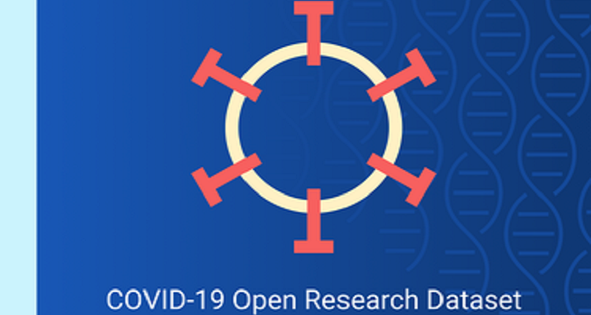

### En este site queremos centralizar todos los esfuerzos que podamos realizar para aplicar técnicas de Inteligencia Artificial sobre el corpus abierto de literatura científica que se ha publicado sobre el COVID-19 (CORD-19)

Desde mediados de marzo, el Allen Institute for Artificial Intelligence mantiene un [corpus actualizado de artículos científicos sobre COVID-19](https://pages.semanticscholar.org/coronavirus-research). A 27 de marzo de 2020 este corpus contiene más de 44.000 artículos en inglés, con el texto completo de más de 29.000 artículos.

Esta ingente cantidad de literatura científica que se ha generado en apenas unos meses desde la aparición del virus demuestra la gran actividad que se ha generado desde el punto de vista científico para su estudio. Pero al mismo tiempo, es tan grande que se ha convertido en un problema para poder encontrar información específica sobre un tipo de tratamiento que se ha probado en algún grupo específico de la población, relaciones entre tratamientos, resultados obtenidos, etc. Esto es lo que normalmente se conoce como sobrecarga de información.

El 16 de marzo del 2020, la Oficina de Política Científica y Tecnológica de la Casa Blanca realizó un llamamiento a la comunidad internacional de Inteligencia Artificial para el desarrollo de técnicas de procesamiento de lenguaje natural y minería de textos que permitieran resolver [preguntas que la comunidad científica se está realizando sobre el COVID-19](https://www.whitehouse.gov/briefings-statements/call-action-tech-community-new-machine-readable-covid-19-dataset/). Muchas de estas preguntas están recogidas como [tareas en la plataforma Kaggle](https://www.kaggle.com/allen-institute-for-ai/CORD-19-research-challenge/tasks)). 

En nuestro grupo llevamos trabajando varios años en el procesamiento de grandes corpus de textos, así que también nos hemos puesto a trabajar para intentar aportar nuestro grano de arena en la solución de estos problemas y por eso lanzamos esta [iniciativa abierta](https://oeg-upm.github.io/covid19/colabora/). 

## Nuestra pregunta: ¿es posible relacionar de algún modo principios activos, grupos terapéuticos, pruebas, tratamientos y diagnósticos que se están reportando en la literatura científica?

La pregunta con la que hemos comenzado a trabajar es esta. Queremos ser capaces de ofrecer herramientas a la comunidad científica, así como a responsables de la gestión de la epidemia, que faciliten la navegación por el corpus para poder entender mejor qué tipos de tratamientos se han probado según lo reportado en la documentación científica, y así permitir entender mejor qué combinaciones de principios activos han sido probadas, lo que podría servir, por ejemplo, para definir nuevos protocolos clínicos de tratamiento para pacientes con algunas condiciones específicas.

Los servicios que hemos construido son la base sobre la que esperamos que este tipo de preguntas se puedan resolver. Aún queda mucho trabajo por hacer, sobre todo para proporcionar unas herramientas más cercanas a los usuarios finales. Por el momento nos hemos centrado en proporcionar las herramientas que otros desarrolladores también pueden utilizar para poder partir de un corpus ya refinado y anotado con una variedad de herramientas.

<!--

  
  <article class="post-preview">
    <a href="{{ post.url | relative_url }}">
	  <h2 class="post-title">{{ post.title }}</h2>

	  
	  <h3 class="post-subtitle">
	    {{ post.subtitle }}
	  </h3>
	  
    </a>

    

      Posted on {{ post.date | date: site.date_format }}
    

    

      
      

        
      

      
      

        {{ post.excerpt | strip_html | xml_escape | truncatewords: site.excerpt_length }}
        
        
          <a href="{{ post.url | relative_url }}" class="post-read-more">[Read&nbsp;More]</a>
        
      

    

    
    

      Tags:
      
      
      <a href="{{ '/tags' | relative_url }}#{{- tag -}}">{{- tag -}}</a>
      
      
        {{ post.tags | join: ", " }}
      
    

    

   </article>
  


<ul class="pager main-pager">
  
  <li class="previous">
    <a href="{{ paginator.previous_page_path | relative_url }}">&larr; Newer Posts</a>
  </li>
  
  
  <li class="next">
    <a href="{{ paginator.next_page_path | relative_url }}">Older Posts &rarr;</a>
  </li>
  
</ul>
-->
