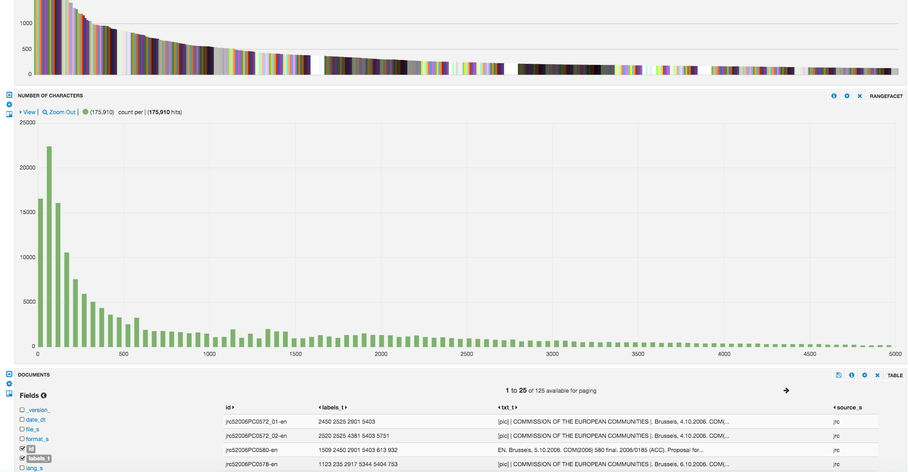
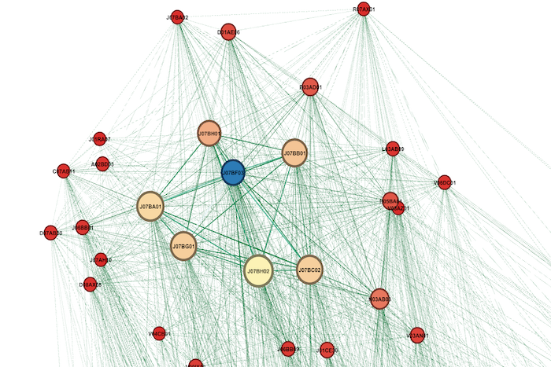

## ¿Qué servicios se pueden usar ahora?

Ponemos los siguientes servicios a disposición del resto de la comunidad:
 * Un [módulo de código abierto](https://github.com/librairy/bio-nlp) y un [servicio abierto](https://librairy.github.io/bio-nlp/) para la anotación de textos con códigos ATC (Sistema de Clasificación Anatómica, Terapéutica, Química) de principios activos (nivel 5) y subgrupos químicos (nivel 4), que puede ser utilizado por cualquier usuario o desarrollador que desee realizar anotaciones sobre textos.

 * Un servicio donde se encuentran todos los documentos indexados (en SOLR): [https://librairy.linkeddata.es/data/covid/select?q=*:*](https://librairy.linkeddata.es/data/covid/select?q=*:*). Este servicio no sólo incluye los datos que se han proporcionado en el corpus, sino también todas las anotaciones que hemos realizado hasta el momento de:

   * Códigos ATC de nivel 4 y 5, generados con el servicio anteriormente mencionado: labels4_t y labels5_t
   * Diagnósticos, patologías y síntomas (generados con la herramienta [CliNER](http://text-machine.cs.uml.edu/cliner/)): annot_cliner_problems_t

Por ejemplo, esta consulta permite buscar los artículos científicos en los que aparece la cloroquina: [http://librairy.linkeddata.es/data/covid/select?q=labels5_t:P01BA01](http://librairy.linkeddata.es/data/covid/select?q=labels5_t:P01BA01). Y esta consulta en los que aparece el lopinavir: [http://librairy.linkeddata.es/data/covid/select?q=labels5_t:J05AR10](http://librairy.linkeddata.es/data/covid/select?q=labels5_t:J05AR10).

También se pueden hacer consultas más complejas, como la que permite buscar los artículos científicos que describan tratamientos antivirales con Interferon - [https://librairy.linkeddata.es/solr/covid/select?q=annot_cliner_treatments_t%3Aantiviral_therapy%20AND%20labels5_t%3AS01AD05](https://librairy.linkeddata.es/solr/covid/select?q=annot_cliner_treatments_t%3Aantiviral_therapy%20AND%20labels5_t%3AS01AD05)

Este índice puede ser consultado de manera gráfica a través de un cuadro de mando muy preliminar (sólo orientado de momento para usuarios expertos), para poder establecer los filtros anteriores. El cuadro de mando está disponible en [http://librairy.linkeddata.es/data/dashboard](http://librairy.linkeddata.es/data/dashboard) (se debe cargar el GIST 4f726911fd9908ffc3a46837b15d8011 para poder acceder a los datos de este índice).

 * Un modelo probabilístico de tópicos entrenado con este corpus de documentos y desplegado en [http://librairy.linkeddata.es/covid19-model/](http://librairy.linkeddata.es/covid19-model/). Este modelo identifica los términos más descriptivos, en el contexto de este corpus, para 3.253 medicamentos identificados a través de su código ATC. Por ejemplo, para cualquier texto este modelo nos puede decir los medicamentos que se han utilizado más habitualmente en textos similares.

Por ejemplo, las palabras que aparecen asociadas más frecuentemente a la combinación de los principios activos estreptomicina e isoniazida, utilizados para el tratamiento de la tuberculosis (cuyo tópico se corresponde con el código ATC: J04AM01) son: feline, fcov, fipv, fcv, fecv, ccov, mnv, norovirus, fip y serotype.

 * Un grafo de principios activos, relacionados entre sí por las intersecciones en las distribuciones de palabras de los documentos en los que aparecen, de acuerdo con el modelo de tópicos anterior. La representación visual de este grafo, que está disponible en formato reutilizable para que pueda ser utilizado por los investigadores, se puede ver en [https://librairy.github.io/covid19/](https://librairy.github.io/covid19/), y algunas otras representaciones se ofrecen a continuación.

* Asimismo, en colaboración con el AI.nnovation Space ([https://www.ainnovation.upm.es/](https://www.ainnovation.upm.es/)), estamos generando una interfaz de navegación que permita hacer búsquedas de palabras clave o términos compuestos generados automáticamente a partir de los textos, y navegar por los artículos científicos cuyo formato PDF está disponible de manera abierta. Por el momento, estos documentos representan una muy pequeña fracción de todos los artículos publicados en el corpus (menos del 3%), pero según se vayan liberando se irán incorporando al sistema. El sistema está disponible en [http://demo.inno.oeg-upm.net](http://demo.inno.oeg-upm.net).

Por ejemplo, como se muestra en la figura, si se teclea la palabra “molecule”, el sistema sugiere, entre otros, los siguientes términos compuestos: “surface molecules”, “cell-adhesion molecules”, “biological macro-molecules”, lo que puede ayudar en dicha navegación. 

